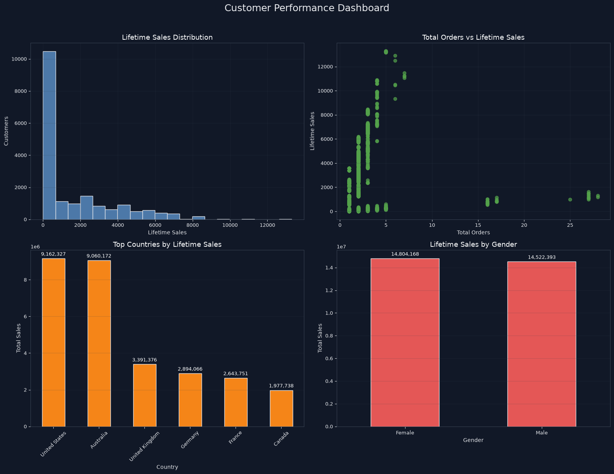
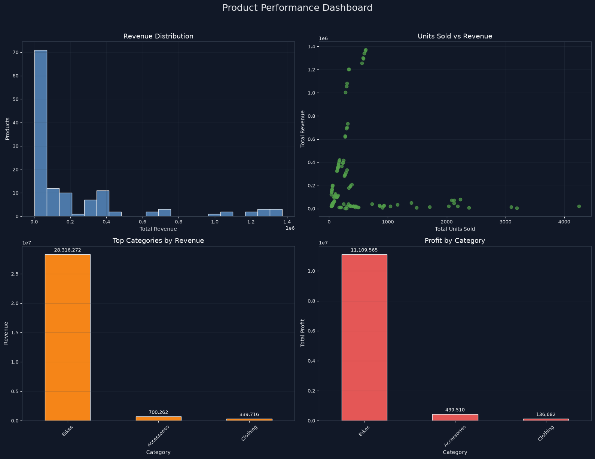

# 📊 E-Commerce Analytics Platform

A production-ready data engineering and analytics platform built with **dbt**, **Snowflake**, and **Python** to transform raw e-commerce data into actionable business intelligence.

## 🎯 Project Overview

This project demonstrates a complete **modern data stack** implementation that ingests raw e-commerce transaction data, transforms it through a dimensional modeling approach, and surfaces insights through automated dashboards and analytical notebooks.

**Key Capabilities:**
- ✅ **ELT Pipeline**: Automated extraction, loading, and transformation of e-commerce data
- ✅ **Dimensional Data Model**: Clean, optimized star schema for analytics
- ✅ **Data Quality**: Automated testing and validation of data transformations
- ✅ **Business Intelligence Dashboards**: Interactive visualizations for customer and product analytics
- ✅ **Scalable Architecture**: Built on Snowflake for enterprise-grade data warehousing

---

## 🏗️ Architecture & Data Model

### Data Pipeline (ELT)

```
Raw Data (Seeds/APIs)
    ↓
Snowflake RAW_DB
    ↓
Staging Layer (Data Cleaning & Standardization)
    ↓
Dimensional Tables (dims_*)
    ↓
Fact Tables (fact_sales)
    ↓
Analytics Marts (mart_customer_sales, mart_product_sales)
    ↓
Dashboards & Insights
```

### Dimensional Model

**Staging Models** (`models/staging/`)
- `stg_raw_cust_info`: Customer dimension standardization
- `stg_raw_cust_az12`: Geographic customer data
- `stg_raw_sales_details`: Transaction detail normalization
- `stg_raw_prd_info`: Product master data
- `stg_raw_px_cat_g1v2`: Product category hierarchy

**Dimensional Tables**
- `dim_customers`: Customer attributes (name, country, gender, birth date)
- `dim_products`: Product catalog with category, subcategory, cost, and line
- `dim_date`: Time dimension for temporal analysis

**Fact Table**
- `fact_sales`: Transaction-level details (order_number, sales_amount, quantity, order_date)

**Analytics Marts**
- `mart_customer_sales`: Customer lifetime value metrics (total_orders, lifetime_sales, avg_line_value, days_since_last_order)
- `mart_product_sales`: Product performance metrics (total_revenue, total_units_sold, total_profit, profit_margin)

---

## � Dashboard Outputs

The project includes two interactive Jupyter notebooks with matplotlib dashboards that visualize key business metrics in real-time.

### Customer Performance Dashboard
**File:** `notebooks/customer_mart_viz.ipynb`

Displays four key customer analytics visualizations:
1. **Lifetime Sales Distribution** (Histogram) — Shows customer value segmentation with bins
2. **Orders vs. Revenue Correlation** (Scatter Plot) — Reveals relationship between purchase frequency and lifetime value
3. **Top 10 Countries by Lifetime Sales** (Bar Chart) — Geographic revenue performance with labeled values
4. **Revenue by Gender** (Bar Chart) — Gender-based customer segmentation
5. **Top 10 Customers by Name** (Detail Chart) — Named customer showcase sorted by lifetime sales



**Features:**
- Dark theme styling for professional presentation
- Automatic data cleaning (handles N/A values)
- Customer names instead of IDs (First + Last name formatting)
- Value labels on bar charts for easy reading
- Responsive 2x2 grid layout

### Product Performance Dashboard
**File:** `notebooks/product_mart_viz.ipynb`

Displays four key product analytics visualizations:
1. **Revenue Distribution** (Histogram) — Product revenue spread across catalog
2. **Units Sold vs Revenue Correlation** (Scatter Plot) — Volume-to-revenue relationship analysis
3. **Top 10 Categories by Revenue** (Bar Chart) — Category performance ranking
4. **Profit by Category** (Bar Chart) — Profitability analysis with margin insights
5. **Top 10 Products by Revenue** (Detail Chart) — Individual product performance



**Features:**
- Dark theme styling consistent with customer dashboard
- Automatic N/A category removal
- Profit margin calculations
- Value labels for quantitative insights
- Professional matplotlib aesthetics

### Running the Dashboards

1. Open Jupyter notebooks in VS Code
2. Execute cells sequentially (Shift+Enter)
3. Dashboards render with live Snowflake data
4. All charts update automatically when underlying data changes

**Dashboard Styling:**
- **Color Palette:** Dark theme (#111827 background) with distinct colors per metric
- **Typography:** Sans-serif, optimized for readability
- **Layout:** 2x2 compact grid + optional detail charts
- **Labels:** Formatted with thousands separators (e.g., "1,250,000")

---

## �🛠️ Tech Stack

| Component | Technology |
|-----------|-----------|
| **Data Warehouse** | Snowflake |
| **Transformation** | dbt (Data Build Tool) |
| **Version Control** | Git + dbt Slim CI/CD |
| **Data Testing** | dbt tests (generic + custom) |
| **Data Quality** | Great Expectations patterns |
| **Analytics & Viz** | Python (pandas, matplotlib) |
| **Notebooks** | Jupyter in VS Code |
| **Dependencies** | dbt_utils package |

---

## 📈 Key Features

### 1. **Automated Data Transformation**
- 7+ staging models for data cleaning and standardization
- Fact and dimension tables following dimensional modeling best practices
- Materialized tables for optimized query performance

### 2. **Data Quality Assurance**
- Generic dbt tests (unique, not_null, relationships)
- Custom data validation tests
- Automated test runs on every transformation

### 3. **Customer Analytics Mart**
Aggregates customer-level metrics:
- Total orders and order lines
- Lifetime sales revenue
- Average line item value
- Days since last purchase (recency metric)

### 4. **Product Analytics Mart**
Analyzes product performance:
- Total units sold and revenue by product
- Profit calculation (revenue - cost)
- Profit margin and category aggregation
- Category and product line breakdowns

### 5. **Interactive Dashboards**
Two Jupyter notebooks with matplotlib visualizations:

**Customer Performance Dashboard** (`notebooks/customer_mart_viz.ipynb`)
- Lifetime sales distribution histogram
- Orders vs. revenue scatter plot
- Top 10 countries by customer lifetime sales
- Revenue breakdown by gender
- Top 10 customers by name and lifetime sales

**Product Performance Dashboard** (`notebooks/product_mart_viz.ipynb`)
- Revenue distribution by product
- Top 10 categories by profit
- Top 10 most profitable products
- Profit margin analysis
- Units sold vs. revenue correlation

### 6. **Data Cleaning & Preparation**
- Handles missing values (N/A, null, empty strings)
- Numeric type coercion for aggregations
- Robust customer name formatting (First + Last name)
- Gender and country standardization

---

## 🚀 Getting Started

### Prerequisites
- Python 3.8+
- Snowflake account with COMPUTE_WH warehouse
- dbt-snowflake adapter

### Installation

1. **Clone the repository:**
   ```bash
   git clone <repo-url>
   cd ecommerce_analytics
   ```

2. **Set up Python virtual environment:**
   ```bash
   python -m venv dbt-env
   source dbt-env/bin/activate
   pip install -r requirements.txt
   ```

3. **Configure Snowflake connection:**
   ```bash
   dbt debug
   ```
   Update `~/.dbt/profiles.yml` with your Snowflake credentials:
   ```yaml
   ecommerce_analytics:
     target: dev
     outputs:
       dev:
         type: snowflake
         account: [your_account_id]
         user: [your_username]
         password: [your_password]
         role: [your_role]
         database: RAW_DB
         schema: ECOM_SOURCE
         warehouse: COMPUTE_WH
   ```

4. **Build the dbt project:**
   ```bash
   dbt build
   ```

5. **Run tests:**
   ```bash
   dbt test
   ```

6. **Open notebooks:**
   - `notebooks/customer_mart_viz.ipynb`
   - `notebooks/product_mart_viz.ipynb`

---

## 📁 Project Structure

```
ecommerce_analytics/
├── README.md                          # This file
├── dbt_project.yml                    # dbt project configuration
├── requirements.txt                   # Python dependencies
├── packages.yml                       # dbt package dependencies
│
├── models/
│   ├── staging/                       # Data cleaning & standardization
│   │   ├── stg_raw_cust_*.sql
│   │   ├── stg_raw_sales_*.sql
│   │   ├── stg_raw_prd_*.sql
│   │   └── _stg_ecom_models.yml
│   ├── marts/                         # Analytics-ready tables
│   │   ├── dim_customers.sql
│   │   ├── dim_products.sql
│   │   ├── dim_date.sql
│   │   ├── fact_sales.sql
│   │   ├── mart_customer_sales.sql   # Customer KPI aggregates
│   │   ├── mart_product_sales.sql    # Product KPI aggregates
│   │   └── _marts__models.yml
│   └── sources.yml                    # Raw data source definitions
│
├── tests/                             # dbt tests & assertions
│   ├── assert_stg_sales_amount_invariant.sql
│   └── generic/                       # Custom test macros
│
├── macros/                            # dbt macros & utilities
│   └── cents_to_dollars.sql          # Currency formatting macro
│
├── seeds/                             # Initial seed data (CSVs)
│   ├── raw_customers.csv
│   ├── raw_orders.csv
│   ├── raw_products.csv
│   ├── raw_items.csv
│   ├── raw_stores.csv
│   └── raw_supplies.csv
│
├── analyses/                          # Ad-hoc analysis queries
│   └── explore.sql
│
├── notebooks/                         # Jupyter analytics notebooks
│   ├── customer_mart_viz.ipynb        # Customer dashboard
│   ├── product_mart_viz.ipynb         # Product dashboard
│   └── visualization.ipynb
│
└── target/                            # dbt build artifacts
    ├── manifest.json
    ├── graph.gpickle
    └── compiled/
```

---

## 🔍 Key Insights & Metrics

### Customer Analytics
- **Total Customers**: Tracked with lifetime value segmentation
- **Lifetime Sales Range**: From $0 to multi-million dollar customers
- **Geographic Distribution**: Sales performance across countries
- **Repeat Purchase Behavior**: Measured by total orders and recency
- **Customer Segmentation**: By gender, country, and purchase value

### Product Analytics
- **Revenue Leaders**: Top-performing products and categories
- **Profitability Analysis**: Gross profit and margin by product
- **Inventory Insights**: Units sold vs. product cost correlation
- **Category Performance**: Category-level revenue and profit aggregations
- **Inventory Optimization**: Identify slow-moving and high-margin products

---

## 💡 Skills Demonstrated

### Data Engineering
✓ **dbt Expertise**: Dimensional modeling, macro development, testing frameworks  
✓ **SQL**: Complex joins, aggregations, window functions, CTEs  
✓ **Snowflake**: Data warehouse design, performance optimization  
✓ **Data Quality**: Test-driven data development, validation automation  

### Analytics & BI
✓ **Data Analysis**: pandas data manipulation and aggregation  
✓ **Visualization**: matplotlib dashboards with dark theme styling  
✓ **Data Cleaning**: Handling missing values and data inconsistencies  
✓ **Dashboard Design**: 2x2 compact layouts with consistent styling  

### Software Engineering
✓ **Version Control**: Git workflows and project organization  
✓ **Configuration Management**: Environment-specific database connections  
✓ **Documentation**: Comprehensive README and model descriptions  
✓ **Reproducibility**: Fully automated, self-documenting pipeline  

---

## 📊 Running Analyses

### Generate dbt Documentation
```bash
dbt docs generate
dbt docs serve
```

### Execute Dashboard Notebooks
1. Open VS Code with workspace
2. Navigate to `notebooks/` folder
3. Run Jupyter cells (Shift+Enter)
4. Visualizations render with Snowflake data

### Run Specific dbt Models
```bash
# Rebuild customer mart
dbt run --select mart_customer_sales

# Run all tests
dbt test

# Generate freshness report
dbt source freshness
```

---

## 🎓 Learning Resources & References

- **dbt Fundamentals**: [learn.getdbt.com](https://learn.getdbt.com)
- **Dimensional Modeling**: Ralph Kimball's Data Warehouse Toolkit
- **Snowflake Best Practices**: [Snowflake University](https://learn.snowflake.com)
- **dbt Packages**: [dbt Hub](https://hub.getdbt.com)

---

## 📝 Next Steps / Future Enhancements

- [ ] Implement dbt Cloud for orchestrated runs
- [ ] Add Great Expectations for advanced data quality monitoring
- [ ] Build Tableau/Looker dashboards for stakeholder reporting
- [ ] Implement incremental models for large fact tables
- [ ] Add dbt Mesh for multi-team governance
- [ ] Integrate real-time streaming with Kafka
- [ ] CI/CD pipeline with dbt Slim and GitHub Actions

---

## 📧 Contact & Portfolio

This project is part of my data engineering and analytics portfolio, showcasing end-to-end data platform design, modern stack implementation, and analytical storytelling capabilities.

**Skills Portfolio**: Data Engineering | Analytics Engineering | Cloud Data Warehousing | Business Intelligence